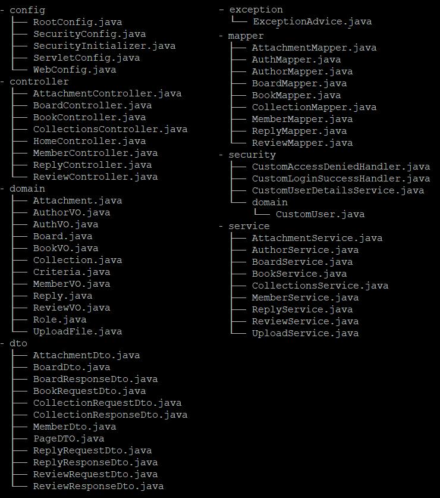
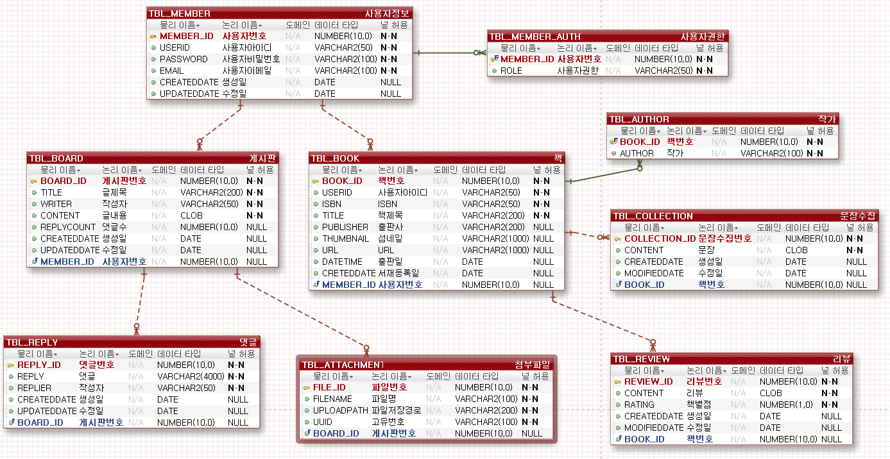

# My Library

카카오 오픈 Api를 이용한 개인 서적 관리 사이트

<br>

## About

1. 내 서재
   - 책 검색 및 서재에 저장, 삭제 및 일괄 삭제 기능
   - 저장한 책의 리뷰와 문장 수집 기능
     - 리뷰 수정, 삭제 및 문장 수집 수정, 삭제
   - 로그인한 사용자가 이용가능함
2. 인증
   - 회원가입
     - Admin 회원가입과 일반 사용자 회원가입 구분
   - 로그인
3. 내 정보 확인
   - 패스워드 변경 및 이메일 변경
   - 현재 저정된 총 책의 수, 리뷰 수, 댓글 수
   - 게시판에 작성한 게시글 수 및 댓글 등록 수
4. 게시판
   - 이미지 및 첨부파일 등록 가능
     - 게시판 글 작성은 로그인한 사용자로 한정
   - 댓글 등록, 수정 삭제 기능
     - 자신의 댓글만 삭제 가능
     - 로그인 한 사용자만이 댓글 등록 가능

<br>

## 목차

1. [개발 환경](#개발-환경)
2. [디렉토리 구조](#디렉토리-구조)
3. [URI Table](#URI-Table)
4. [ERD](#ERD)
5. [UI](#UI)
6. [사이트 링크](#사이트-링크)

<br>

## 개발 환경

1. IDE : Eclipse

```
version : 2020-06 (4.16.0)
```

2. JDK

```
jdk-1.8.0_231
```

3. WAS

```
Tomcat 9.0.37
```

4. dependencies

```java
// spring framework
springframework-version : 5.0.7

// spring-security
spring-security-web : 5.0.7
spring-security-config : 5.0.7
spring-security-core : 5.0.7
spring-security-taglibs : 5.0.7

// servlet
javax.servlet : 3.1.0

// junit
junit : 4.12

// connection pool
HikariCP : 2.7.8

// ORM
mybatis : 3.4.6
mybatis-spring : 1.3.2

// jackson
jackson-annotation : 2.9.2
jackson-core : 2.9.6
jackson-databind : 2.9.6

// lombok
lombok : 1.18.0
```

5. Bootstrap

```
v4.4
```

6. JQuery

```
3.5.1
```

7. AWS

EC2

```
Amazon linux 2
```

RDS

```
Oracle 12.1.0.2.v2
```

<br>

## 디렉토리 구조

<br>



<br>
<br>

## URI Table

<br>

### HomeController

| Task              | URI | Http method | 비고 |
| ----------------- | --- | ----------- | ---- |
| 메인화면 화면이동 | /   | GET         | -    |

<br>

### BookController

| Task                     | URI                 | Http method | URL 이동 |
| ------------------------ | ------------------- | ----------- | -------- |
| 내 서재 책 목록          | /books/             | GET         | -        |
| 책 상세조회 화면 이동    | /books/:book_id     | GET         | -        |
| 책 삭제화면 이동         | /books/edit         | GET         | -        |
| 책 검색화면 이동         | /books/search       | GET         | -        |
| 서제 내 책검색 화면 이동 | /books/result       | GET         | -        |
| 책 저장                  | /books/             | POST        | -        |
| 책 저장 시 중복 검사     | /books/verification | POST        | -        |
| 책 삭제                  | /books/remove       | POST        | 이동     |
| 책 삭제                  | /books/:book_id     | DELETE      | 이동     |
| 책 일괄삭제              | /books/edit         | DELETE      | 이동     |

<br>

### ReviewController

| Task      | URI              | Http method | URI 이동 |
| --------- | ---------------- | ----------- | -------- |
| 서평 조회 | /review/:book_id | GET         | -        |
| 서평 등록 | /review          | POST        | -        |
| 서평 수정 | /review/:book_id | PUT         | -        |
| 서평 삭제 | /review/:book_id | DELETE      | -        |

<br>

### CollectionsController

| Task           | URI                         | Http method | URI 이동 |
| -------------- | --------------------------- | ----------- | -------- |
| 문장 목록 조회 | /books/:book_id/collections | GET         | -        |
| 문장 조회      | /collections/:collection_id | GET         | -        |
| 문장 등록      | /collection                 | POST        | -        |
| 문장 수정      | /collections/:collection_id | PUT         | -        |
| 문장 삭제      | /collections/:collection_id | DELETE      | -        |

<br>

### MemberController

| Task                      | URI                           | Http method | URI 이동 |
| ------------------------- | ----------------------------- | ----------- | -------- |
| 로그인 화면이동           | /member/login                 | GET         | -        |
| 회원가입 화면이동         | /member/signin                | GET         | -        |
| 내 정보 화면이동          | /member/info                  | GET         | -        |
| 회원가입                  | /member/signup                | POST        | 이동     |
| 사용자 패스워드 변경      | /member/password              | POST        | -        |
| 사용자 이메일 변경        | /member/email                 | POST        | -        |
| 사용자 아이디 중복 검사   | /member/verification/userid   | POST        | -        |
| 사용자 이메일 중복 검사   | /member/verification/email    | POST        | -        |
| 사용자 패스워드 일치 검사 | /member/verification/password | POST        | -        |

<br>

### BoardController

| Task               | URI                     | Http method | URI 이동 |
| ------------------ | ----------------------- | ----------- | -------- |
| 게시판 화면이동    | /board                  | GET         | -        |
| 게시판 글 화면이동 | /board/:board_id        | GET         | -        |
| 글쓰기 화면이동    | /board/post             | GET         | -        |
| 글 수정            | /board/modify/:board_id | GET         | -        |
| 글 등록            | /board/post             | POST        | 이동     |
| 수정된 글 등록     | /board/modify/:board_id | POST        | 이동     |
| 글 삭제            | /board/delete/:board_id | POST        | 이동     |

<br>

### ReplyController

| Task           | URI                                 | Http method | URI 이동 |
| -------------- | ----------------------------------- | ----------- | -------- |
| 댓글 목록 조회 | /board/:board_id/replies/page/:page | GET         | -        |
| 댓글 조회      | /replies/:reply_id                  | GET         | -        |
| 댓글 등록      | /reply                              | POST        | -        |
| 댓글 수정      | /replies/:reply_id                  | PUT         | -        |
| 댓글 삭제      | /replies/:reply_id                  | DELETE      | -        |

<br>

### AttachmentController

| Task           | URI              | Http method | URI 이동 |
| -------------- | ---------------- | ----------- | -------- |
| 파일 목록 조회 | /files/:board_id | GET         | -        |
| 파일 다운로드  | /file/download   | GET         | -        |
| 파일 업로드    | /files/upload    | POST        | -        |
| 파일 삭제      | /file/delete     | POST        | -        |

<br>
<br>

## ERD



<br>
<br>

## UI

<br>
<br>

## 사이트 링크

[사이트 바로가기](http://15.165.253.123:8080/)

<br>
<br>
