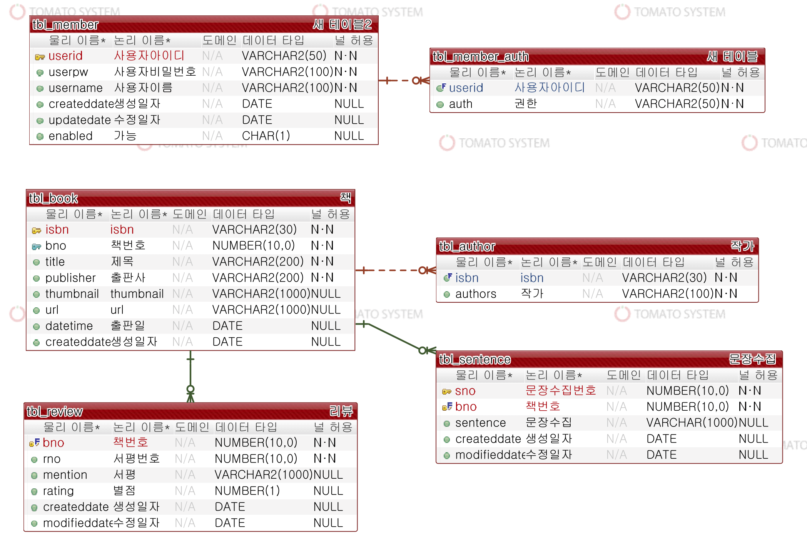

# My Library
카카오 오픈 Api를 이용한 개인 서적 관리 사이트

<br>

## About
---
구입한 책을 관리하는 사이트입니다.  
기능으로는 
- 검색 기능
    - 등록할 책 검색  
    - 내 서재 내의 책 검색  
- 등록 기능
    - 내 서제에 책 등록
    - 서평 등록
    - 문장 수집 등록
 
- 수정 및 삭제 기능
    - 책 삭제
    - 서평 수정 및 삭제
    - 문장 수집 수정 및 삭제
- 로그인 기능 (spring security)
    - admin 계정, member 계정으로 로그인
    - AccessDenied 구현

- 기타 기능
    - 책 검색 시 pagination 추가
    - 내 서제의 pagination 추가
    - 내 서제 내의 검색 시 pagination 추가
    - 책 일괄 삭제 (프론트 엔드 개발중, 백엔드 개발 완료)

- 추가 예정 기능
    - 구입예정인 책 리스트 목록 만들기 (위시리스트)
    - 친구에게 추천할 책 리스트 생성
    - 책 URL을 친구에게 공유
    - 문장 수집 시, 사진으로 파일 업로드


<br>

## 목차
---
1. [개발 환경](#개발-환경) 
2. [디렉토리 구조](#디렉토리-구조)
3. [URI Table](#URI-Table)
4. [ERD](#ERD)
5. [UI](#UI)
6. [사이트 링크](#사이트-링크)

<br>

## 개발 환경
---
1. IDE : Eclipse
```
version : 2020-06 (4.16.0)
```
2. JDK
```
jdk-1.8.0_231
```
3. WAS
```
Tomcat 9.0.37 
```
4. dependencies
```java
// spring framework
springframework-version : 5.0.7

// spring-security
spring-security-web : 5.0.7
spring-security-config : 5.0.7
spring-security-core : 5.0.7
spring-security-taglibs : 5.0.7

// servlet
javax.servlet : 3.1.0

// junit
junit : 4.12

// database
HikariCP : 2.7.8
mybatis : 3.4.6
mybatis-spring : 1.3.2

// jackson
jackson-annotation : 2.9.2
jackson-core : 2.9.6
jackson-databind : 2.9.6

// lombok
lombok : 1.18.0
```
5. Bootstrap
```
v4.0
```
6. JQuery
```
3.5.1
```
7. AWS

EC2
```
Amazon linux AMI 2018.03
```
RDS 
```
Oracle 12.1.0.2.v2 
```
<br>

## 디렉토리 구조
---


<br>
<br>

## URI Table
---
<br>

BookController

|Task|URL|Method|Parameter|Form|URL 이동|
|-----|------|------|-------|-----|------|
|내 서재 전체 목록|/book/|GET|-|-|-|
|검색화면 이동|/book/search|GET|-|-|-|
|서제 내 책검색|/book/result|GET|-|-|-|
|책 상세조회|/book/one|GET|bno|-|-|
|책 삭제|/book/remove|POST|bno|-|이동|

<br>    

ApiController

|Task|URL|Http 전송방식|비고|
|-----|------|------|-------|
|책 등록|/api/addbook|POST|-|
|책 조회|/api/:isbn|GET|-|

<br>

ReviewController

|Task|URL|Http 전송방식|비고|
|-----|------|------|-------|
|서평 조회|/review/new|POST|-|
|서평 등록|/review/:bno|GET|-|
|서평 수정|/review/:bno|PUT|-|
|서평 삭제|/review/:bno|DELETE|-|

<br>

SentenceController

|Task|URL|Http 전송방식|비고|
|-----|------|------|-------|
|문장수집 조회|/sentence/new|POST|-|
|문장수집 등록|/sentence/:bno|GET|-|
|페이지|/sentence/:bno/:page|GET|개발중|
|문장수집 수정|/sentence/:bno|PUT|-|
|문장수집 삭제|/sentence/:bno|DELETE|-|

<br>

CommonController

|Task|URL|Http 전송방식|비고|
|-----|------|------|-------|
|로그인|/customLogin|GET|-|
|로그아웃|/customLogout|GET|-|
|Access Denied|/accessError|GET|-|


<br>

## ERD
---




<br>
<br>


## UI
---


<br>
<br>

## 사이트 링크
---

[사이트 바로가기](http://13.125.186.107:8080/book/)

<br>
<br>
